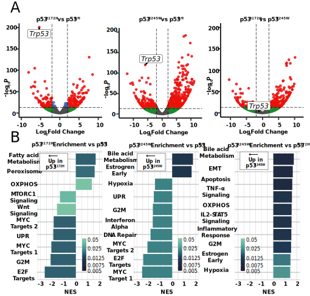

## Results {.page_break_before}

_**P53-mutant Alleles Differentially Alter BRAF (V600E) Lung Tumorigenesis**_

Expression of BRAF^V600E^ in the distal epithelium of the mouse lung elicits clonal tumorigenic outgrowths of alveolar type 2 (AT2) pneumocytes (Dankort et al. 2007).Prior work has shown that _Trp53^fl/fl^_ cooperates with BRAF(V600E) to form malignant lung tumors when Cre recombinase is activated [@pmid:17299132; @pmid:26001956]. Therefore, we compared the tumor burden of _Braf^Cat/+^_ mice with either p53 loss (_Trp53^fl/fl^_, p53^R172H^ (_Trp53^R172H/R172H^_), or p53^R245W^ (_Trp53^R245W/R245W^_) after infection with 106 pfu of adenovirus expressing surfactant protein C specific Cre (ad5-Spc-Cre) (Figure @fig:01 A). As expected, mice developed lung cancer, consistent with previous findings (Figure @fig:01 B-C). However, there was a striking, highly reproducible increase in the tumor size of tumors harboring _Trp53^R172H/R172H^_ and to a lesser extent _Trp53^R245W/R245W^_, compared to _Trp53^fl/fl^_ (Figure @fig:01 B-D). These data led us to hypothesize that p53^R172H^ and p53^R245W^ expression alters tumor progression uniquely from p53 deletion, and these differences may be potentially evident of gain-of-function effects imparted by mutant-53. Since lung cancer patients with mutations in _TP53_ often start only have one mutated _p53_ allele unless loss of heterozygosity (LOH) occurs. Therefore, we generated mice heterozygous for both _Braf^CAT^_ and either _Trp53^fl^_ , _Trp53^R172H^_, or _Trp53^ R245W^_ and observed their survival over time (Figure @fig:01 E). We noted that _Trp53^R172H/+^_ mice had diminished median overall survival compared to _Trp53^fl/+^_ mice (183 days and 216 days), with _Trp53^R245W/+^_ mice falling in between the two groups (median survival 212 days) (Figure @fig:01 E).

We observed a distinct separation of survival between mice harboring lung tumors that are either _Trp53^fl/+^_, _Trp53^R172H/+^_, and _Trp53^R245W/+^_, this separation is diminished when altered p53 alleles are homozygous (Figure @fig:01 F). _Trp53^R172H/R172H^_ mice have a median survival of 120 days while _Trp53^fl/fl^_ mice have a median survival of 136 days. Importantly, this observed difference in survival is statistically significant (Log-rank test p< 0.001) and is likely a reflection of worse diseased, characterized by enhanced tumor burden and tumor size.

![**Differential BRAF^V600E^ lung tumorigenesis imparted by p53-Hotspot mutants.** **(A)** Genetically-engineered alleles of _Braf^v600E^_ and ^Trp53^ before and after Cre-Recombinase. **(B)** Tumor burden and *(C)*** Tumor size of BRAF(V600E) plus Trp53-wildtype, null, or mutant alleles 14 weeks post Cre-mediated recombination. *(D)*  Representative H&E images 14 weeks after Cre-recombination. **(E)** Survival of mice with Heterozygous _Trp53_ mutant alleles. **(F)** Survival of mice with homozygous _Trp53_ alleles.](images/figure1_021022.svg){#fig:01 .white width="100%"}

_**Mutant-p53 Accumulation is Associated with Dedifferentiation and p19 Induction**_

Increased malignancy in lung adenocarcinoma is often associated with altered states of tumor cell identity and dedifferentiation [@pmid:31452510;@pmid:32707077]. Since LUADs often arise from AT2 cells, we surveyed the expression of AT2 cell identifiers, such as NKX2-1, a master regulator of AT2 transcriptional programs, and SPC, a marker of differentiated AT2 cells [@pmid:32707077]. Quantification of over 50 tumors from _Braf^V600E/+^_ mice with either _Trp53^ flfl^_, _Trp53^R172H/R172H^_, and _Trp53^R245W/R245W^_ revealed that _Trp53^R172H/R1722H^_ mice had significantly more tumors that stained negative for NKX2-1 and SPC (Figure @fig:02 A an B). This finding strongly indicates that mutant-p53 tumors are dedifferentiated. Since HMGA2 expression is associated with LUAD dedifferentiation and worse patient prognosis, we performed IHC for HMGA2 (Cite). We noted an increase in HMGA2-positive tumors in both _Trp53^R172H/R172H^_, and _Trp53^R245W/R245W^_ tumors compared to _Trp53^fl/fl^_ (Figure @fig:02 A,B). Thus, this data taken together reveals that Trp53R172H/R172H mice exhibit both a higher tumor burden and worse overall survival than _Trp53^fl/fl^_, but the tumors developed in these mice are more likely to exhibit malignant progression and dedifferentiation.

One striking feature of lung tumors in mice either heterozygous or homozygous for _Trp53 ^R172H^_ or _Trp53^R245W^_ is how few tumors and tumor cells have detectable levels of mutant-p53 protein as measured by Immunohistochemistry (IHC). One critical aspect of normal p53 function is self-regulation through transcriptional activation of its negative regulator MDM2 [@pmid:8319905]. Thus, we predicted that homozygous p53 mutant-cells would exhibit increased mutant-p53 protein. Interestingly, in our models, we observed mutant p53 protein accumulation is restricted to malignant cells exhibited by lack of papillary architecture and nuclear atypia (Figure @fig:02 C). Indeed, p53 immunostaining is correlated with increased phospho-ERK1/2 detection (Figure @fig:02 D). Moreover, immunofluorescence of p53 and its positive regulator, p19/ARF, reveal cells with high p19/ARF are also high in p53 accumulation (Figure @fig:02 D). This result suggests that even in homozygous mutant_Trp53_ mice, there is still a barrier to mutant-p53 accumulation, and our data suggests that elevated levels of p19/ARF is important for mutant-p53 accumulation, even with homozygous p53 mutations. Collectively, these data indicate that _Trp53^R172H^_ drives more aggressive lung adenocarcinoma formation in BRAF(V600E) driven mouse models of lung cancer.

![**Missense mutant-p53 alters lung adenocarcinoma differentiation status and accumulation of mutant-p53 correlates with p19 ARF expression.** **(A)** Panel representative IHC sections stained with SPC,NKX2-1, p53 and HMGA2. **(B)** H-score of individual tumors. **(C)** Association between mutant-p53 R172H accumulation and increased malignancy and dedifferentiation. **(D)** serial section of P53-HI and pERK1/2-HI tumors compared to adjacent low. **(E)** Colocalization of p19/ARF and p53 in p53-mutant tumors](images/figure2_021722.svg){#fig:02 .white width="100%"}

_**P53^R172H^ and P53^R245W^ cell lines are refractory to BRAF/MEK inhibition**_

Given that previous research has determined that p53 mutations can confer resistance to both chemotherapies and pathway-targeted therapies [@pmid:7585548;@pmid:22068033], we next questioned whether our p53 alterations would be sufficient to drive therapeutic resistance in BRAF^V600E^-driven cell lines exposed to pathway-targeted therapeutics commonly administered to BRAF^V600E^ mutant patients, such as the combination of dabrafenib (BRAFi) plus trametinib (MEKi) [@pmid:27283860]. Cell lines were derived from _Braf^CAT/+^_ murine tumors expressing either _Trp53^flfl^_, _Trp53^R172H/R172H^_, or _Trp53^R245W/R245W^_) 14 weeks after infection with ad5-Spc-Cre. Cell lines expressing either _Trp53^R172H/R172H^_ or _Trp53^R245W/R245W^_ were completely resistant to single agent dabrafenib and resistant to the combination of dabrafenib plus trametinib (Figure @fig:03 A,B). Of note, _Trp53^R172H/R172H^_ and _Trp53^R245W/R245W^_ cell lines express increased ERK1/2 activity, as evidenced by increased phosphorylated ERK1/2, both with and without Dabrafenib and Trametinib (Figure @fig:03 E). Moreover, _Trp53^R172H/R172H^_ mice retain a larger tumor burden after a week 4 treatment of MAPK blockade _in vivo_ (Figure @fig:03 E). To gain relevance to human lung cancer, we infected BRAF(V600E) mutant HCC364 cells with lentivirus expressing human cancer hotspot mutant p53^R175H^. p53^R175H^ expressing cells were more proliferative and more refractory than parental HCC364 cells (Figure @fig:03 F and G).Collectively, these _in vitro_ and _in vivo_ data suggest missense mutant p53^R175H^ and its murine homologue p53^R172H^, as well as p53^R245W^ can support cancer cell viability in the face of BRAF+MEK blockade that cannot be achieved by p53-null mutations.

![**Mutant-p53 cell lines are refractory to BRAFi+MEKi.** **(A)** Response of GEMMs to BRAFi+MEKi chow after four weeks **(B)** in vitro dose response to BRAFi single agent. **(C)** in vitro timecourse with dabrafenib (1000nm) plus trametinib (100nM). **(D)** Accumulation of dead cells in dabrafenib plus trametinib measured by CytotoxRed accumulation. **(E)** Immunoblotting of phospho-ERK1/2 in response to dabrafenib plus trametinib. **(F)** Ectopic expression of p53^R17H^ in human HCC364 cells. **(E)** Response of p53^R175H^ cells to dabrafenib plus trametinib. ](images/figure3_021722.svg){#fig:03 .white width="100%"}

_**P53^R172H^ and P53^R245W^ alters the transcriptome of BRAF(V600E) lung tumor cell lines**_

Due to our observations that mutant p53^R172H^ drives more aggressive cancer phenotypes such as increased growth, dedifferentiation, and resistance to FDA-approved therapeutics, we reasoned that this would be reflected in a change in the transcriptional landscape. This is due in part, by the transcriptional trans-activation potential by mutant p53. RNA sequencing of cell lines generated from p53-mutant mouse lung tumors do reveal transcriptomic differences between both p53^R172H^ and p53^R245W^ cells compared to p53-null cell lines (Figure @fig:04 4 A). Interestingly, genes involved in cell cycle regulation, epithelial-to-mesenchymal transition (EMT), and MYC pathway are upregulated in both p53^R172H^ and p53^R2245W^ cell lines (Figure 4 @fig:04 B). These results suggest that mutant-p53 is affecting transcription of genes involved in pro-growth signaling pathways.

{#fig:04 .white width="100%"}

